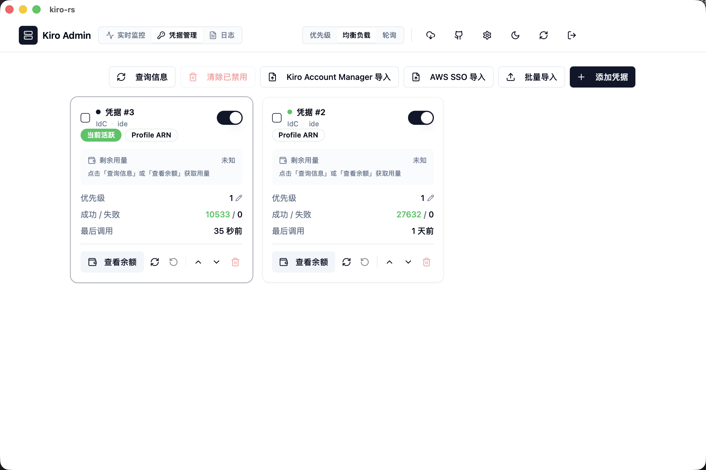
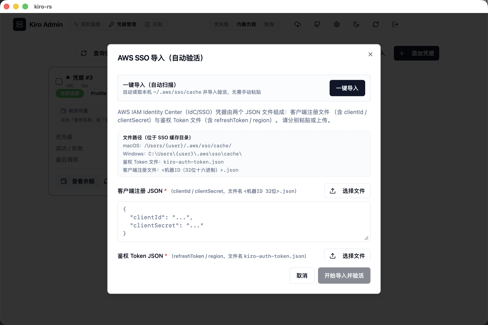
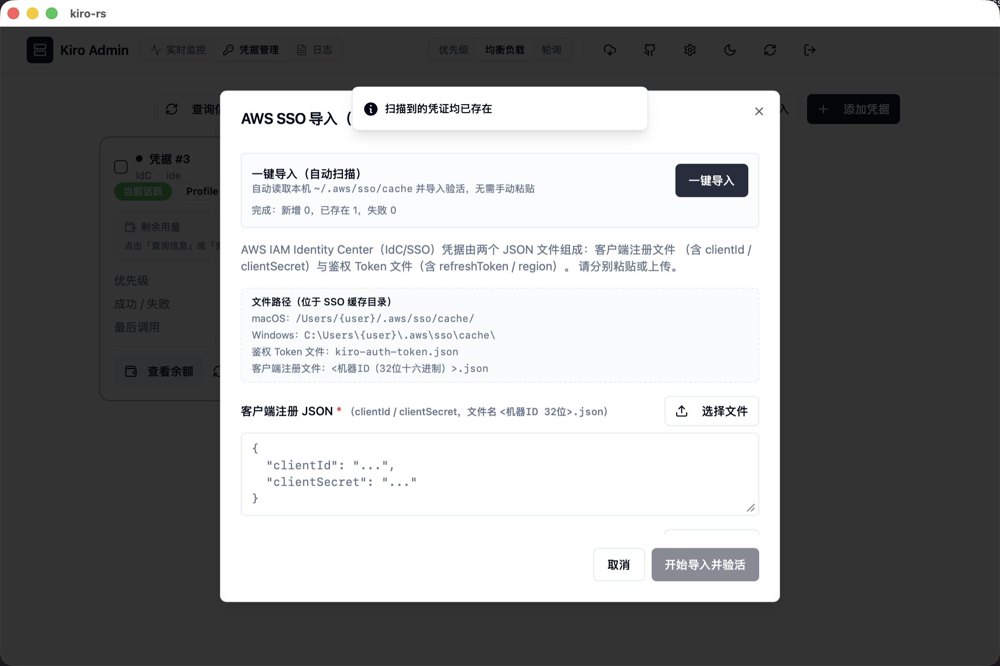
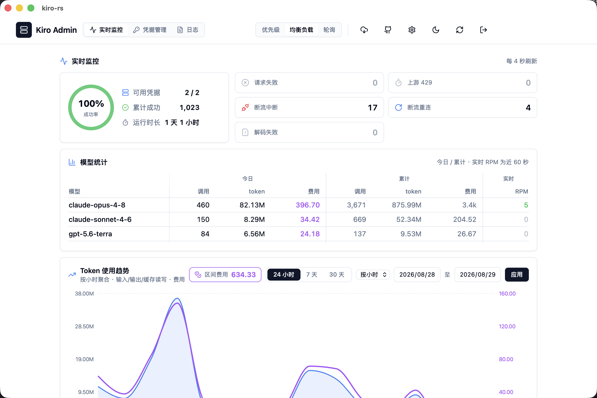
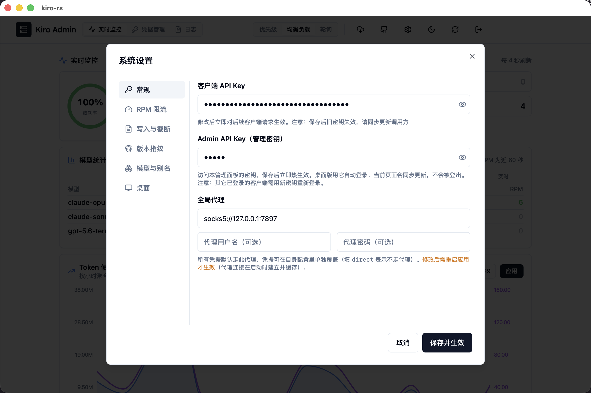
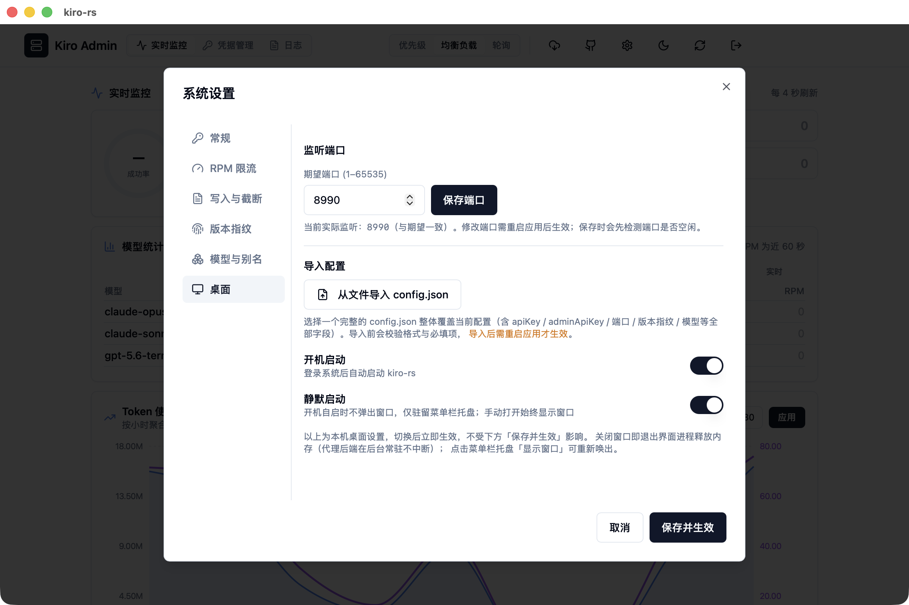

# kiro-rs 桌面版 · 新手引导

本文带你走完桌面版最常用的两件事：

1. **用「一键导入」自动导入本机 AWS SSO 凭证**，无需手动复制粘贴 JSON；
2. **用 CC Switch 把 kiro-rs 接入 Claude Code 和 Codex**，让它们的请求都走本地代理。

> kiro-rs 桌面版在本机监听一个端口（默认 `8990`），对外同时提供 Anthropic 兼容端点（给 Claude Code）和 OpenAI 兼容端点（给 Codex）。任何支持这两种 API 的客户端把地址指过来即可。

> 项目地址：<https://github.com/ykn1002/kiro.rs>（下载安装包、查看更新请到此仓库的 Releases 页）。

---

## 目录

- [开始之前：安装并打开桌面版](#开始之前安装并打开桌面版)
- [第一部分：用一键导入导入 AWS SSO 凭证](#第一部分用一键导入导入-aws-sso-凭证)
  - [前置条件](#前置条件)
  - [操作步骤](#操作步骤)
  - [结果说明](#结果说明)
  - [手动导入（兜底）](#手动导入没有本机缓存时的兜底)
- [第二部分：用 CC Switch 接入 Claude Code 与 Codex](#第二部分用-cc-switch-接入-claude-code-与-codex)
  - [先确认两个值](#先确认两个值)
  - [接入 Claude Code（用 /cc 端点）](#接入-claude-code用-cc-端点)
  - [接入 Codex（用 /v1 端点）](#接入-codex用-v1-端点)
  - [验证是否接通](#验证是否接通)
  - [不用 CC Switch 的手动等效方式](#不用-cc-switch-的手动等效方式)
- [第三部分：让它常驻后台（开机启动与静默启动）](#第三部分让它常驻后台开机启动与静默启动)
  - [开机启动](#开机启动)
  - [静默启动](#静默启动)
  - [关窗自动省内存](#关窗自动省内存)
- [常见问题](#常见问题)

---

# 开始之前：安装并打开桌面版

## 1. 下载安装包

到项目 Releases 页下载对应平台的安装包：<https://github.com/ykn1002/kiro.rs/releases>

- **macOS**：下载 `.dmg`，打开后把 `kiro-rs` 拖进「应用程序」，然后从「应用程序」或启动台打开。
- **Windows**：下载 `.exe`（NSIS 安装包）。它**不是绿色免安装版，需要先安装**：双击安装包，按向导下一步完成安装（会装进程序目录并创建开始菜单/桌面快捷方式），之后从**开始菜单或桌面快捷方式**启动，不要直接反复运行那个安装包。

## 2. 首次打开会被系统拦截（正常现象）

本 app **没有做代码签名**，首次打开会被系统拦一下，按下面处理一次即可，之后就正常了：

**macOS**：双击提示「已损坏」或「无法验证开发者」，用下面任一方法放行（只需一次）：

- **方法 A（从隐私设置放行）**：先双击一次 kiro-rs（会被拦、报错，正常），然后去 **系统设置 → 隐私与安全性**，往下拉到「安全性」区域，会看到一行「已阻止 kiro-rs…」，点右侧的「**仍要打开**」，再在弹窗里确认。
- **方法 B（右键打开）**：在「应用程序」里**右键点 kiro-rs 图标 → 打开**，在弹窗里再点「打开」。

> 极少数情况下（提示「已损坏」且上面两种都不出现放行按钮），在终端执行一次 `xattr -dr com.apple.quarantine /Applications/kiro-rs.app` 解除隔离，再打开即可。

**Windows**：**安装时**（双击安装包那一步）如果弹出蓝色 SmartScreen 提示「Windows 已保护你的电脑」，点「更多信息」→「仍要运行」，即可继续安装向导。安装完成后从开始菜单打开就不会再拦了。

## 3. 打开后直接就是管理界面

桌面版打开后**自动登录**，不需要输入任何密码，直接进入管理界面。你会看到顶部三个标签：**实时监控 / 凭据管理 / 日志**，以及右上角一排图标按钮（下载更新、GitHub、设置齿轮、主题、刷新、退出）。

> 桌面版靠内置的管理密钥自动登录；这和后面要用的**接入 Key** 不是一回事（区别见[从哪获取接入 Key](#从哪获取接入-key)）。

至此 app 已经跑起来了。接下来先导入凭证（第一部分），再把它接到 Claude Code / Codex（第二部分）。

---

# 第一部分：用一键导入导入 AWS SSO 凭证

一键导入会扫描本机 AWS IAM Identity Center（IdC / SSO）缓存目录里的凭证文件，自动导入 kiro-rs 并完成验活，全程无需手动粘贴 JSON。

> 一键导入是**桌面版专属**功能。纯 Web 部署下看不到「一键导入」按钮，只能手动粘贴/上传两个 JSON 文件。

## 前置条件

一键导入靠扫描本机 SSO 缓存实现，所以你需要**先在本机用 Kiro 客户端登录过一次 AWS Builder ID / IdC**。这里的凭证文件是 **Kiro IDE / Kiro 客户端**登录 AWS 时写到本机缓存目录里的——kiro-rs 只是去读取它们，自己不产生。

> 如果你从没装过 Kiro、也没在这台机器上登录过 AWS，缓存目录会是空的，一键导入必然扫不到东西。请先安装 Kiro 客户端并用你的 AWS Builder ID / IdC 登录一次，再回来做一键导入。

登录成功后，缓存目录会生成下面两类文件：

| 平台 | SSO 缓存目录 |
| --- | --- |
| macOS / Linux | `~/.aws/sso/cache/` |
| Windows | `C:\Users\{用户名}\.aws\sso\cache\` |

目录里需要有这两类文件（一键导入靠它们组装凭证）：

- **鉴权 Token 文件**：`kiro-auth-token.json`（可能有多个，含 `refreshToken` / `region` / `clientIdHash`）
- **客户端注册文件**：`<clientIdHash>.json`（文件名是 32 位十六进制，含 `clientId` / `clientSecret`）

两者通过 token 文件里的 `clientIdHash` 关联——它正好等于客户端注册文件的文件名（去掉 `.json`）。

> 如果目录不存在或没有 `kiro-auth-token*.json`，扫描会返回空，提示「未扫描到可导入的凭证」。这通常说明你还没在本机用 Kiro 登录过。

## 操作步骤

### 1. 打开「凭据管理」页

启动 kiro-rs 桌面版，顶部切到 **凭据管理** 标签。右上角能看到一排导入按钮，其中就有 **AWS SSO 导入**。



### 2. 点「AWS SSO 导入」打开对话框

对话框顶部就是桌面版专属的 **一键导入（自动扫描）** 区块，说明写着「自动读取本机 `~/.aws/sso/cache` 并导入验活，无需手动粘贴」。

下方还列出了各平台的缓存目录路径和两类文件名，方便你核对本机是否具备条件。



> 下面两个 JSON 输入框是**手动导入**用的兜底方式。走一键导入时不用管它们。

### 3. 点「一键导入」

点击右侧的 **一键导入** 按钮，程序会：

1. 扫描本机 SSO 缓存目录，找出所有可组装的凭证候选；
2. 逐条去重（按 `refreshToken` 的哈希比对已有凭据，避免重复）；
3. 对新凭证调用添加流程，自动完成**验活**；
4. 汇总结果：**新增 / 已存在 / 失败** 各多少条。

导入过程中按钮会显示「扫描导入中」，完成后在区块内给出统计，右上角也会弹提示。



上图是一个**凭证之前已导入过**的例子，所以结果是「已存在 1」。首次导入成功时你会看到「新增 N」并弹出绿色成功提示。

### 4. 确认导入结果

关闭对话框，导入成功的凭证会作为卡片出现在「凭据管理」页；切到 **实时监控** 页，「可用凭据」计数也会随之增加，说明凭证已进入调度池、可以开始接管请求。



## 结果说明

一键导入完成后，统计里的三类结果含义如下：

| 结果 | 含义 | 说明 |
| --- | --- | --- |
| **新增** | 成功导入并验活的新凭证 | 已加入调度池，立即可用 |
| **已存在** | 该 `refreshToken` 对应的凭证此前已导入 | 自动跳过，不会重复添加 |
| **失败** | 验活或添加失败 | 常见原因：refreshToken 已失效、网络/代理问题；失败的凭证会自动回滚（禁用并删除），不会残留 |

## 手动导入（没有本机缓存时的兜底）

如果目标凭证不在当前这台机器上（比如从别处拿到的 JSON），可以在同一个对话框里手动导入：

1. 把**客户端注册 JSON**（含 `clientId` / `clientSecret`）粘贴或用「选择文件」上传到第一个输入框；
2. 把**鉴权 Token JSON**（含 `refreshToken` / `region`）粘贴或上传到第二个输入框；
3. 点 **开始导入并验活**。

两个文件都识别成功后，对话框会提示「✓ 已识别 IdC 凭据」，此时「开始导入并验活」按钮才可点击。

---

# 第二部分：用 CC Switch 接入 Claude Code 与 Codex

[CC Switch](https://github.com/farion1231/cc-switch) 是一个管理 Claude Code / Codex 等工具多个 API 供应商、一键切换的 GUI 工具。它的本质是帮你改写这些工具使用的接口地址和密钥。我们把 kiro-rs 添加成一个「供应商」即可。

> 还没装 CC Switch 的话，先到它的项目页下载安装：<https://github.com/farion1231/cc-switch>。如果你不想用它，也可以跳过，直接看本节末尾的[手动等效方式](#不用-cc-switch-的手动等效方式)。

**关键区别：Claude Code 走 `/cc` 端点，Codex 走 `/v1` 端点。** 两者共用同一个接入 Key。

## 先确认两个值

| 值 | 填什么 |
| --- | --- |
| 接入 Key | kiro-rs 的**客户端 API Key**（就是你连接 kiro-rs 用的密钥，不是管理密码） |
| 本机地址 | 默认 `http://127.0.0.1:8990`（端口若冲突，以桌面版「设置」里显示的实际端口为准） |

### 从哪获取接入 Key

点桌面版顶部工具栏的**齿轮图标**打开「系统设置」，在 **常规** Tab 的第一项就是 **客户端 API Key**（默认是掩码，点右侧小眼睛可显示明文）。这个值就是接入 Key，填给 CC Switch / Claude Code / Codex 的都是它。



> - 别把下面的 **Admin API Key（管理密钥）** 当接入 Key 用——那是登录管理面板的密码，两者不是一回事。
> - 想换一个更强的接入 Key，在这里直接改、点「保存并生效」即可。注意保存后**旧 Key 立刻失效**，记得同步更新 CC Switch / Claude Code / Codex 里填的值。
> - 也可以直接查看 kiro-rs 目录下 `config.json` 里的 `apiKey` 字段，值是一样的。

> **为什么 Claude Code 用 `/cc`？** `/cc/v1` 是缓冲模式端点，会等上游返回上下文用量后再回填 `input_tokens`，统计更准，还带工具调用截断纠正，更适合 Claude Code 的多轮工具往返。
>
> **为什么 Codex 用 `/v1`？** Codex 走的是 OpenAI Responses 协议，命中 kiro-rs 的 `/v1/responses` 端点；`/cc` 下没有这个端点。

## 接入 Claude Code（用 /cc 端点）

在 CC Switch 里新增一个供应商：

| CC Switch 字段 | 填什么 |
| --- | --- |
| 名称 | 随便起，比如 `kiro-rs (Claude Code)` |
| Base URL / 接口地址 | `http://127.0.0.1:8990/cc` |
| API Key / 密钥 | 你的接入 Key |

保存后在 CC Switch 里**切换**到这个供应商。它会把配置写进 Claude Code，等价于设置了：

- `ANTHROPIC_BASE_URL=http://127.0.0.1:8990/cc`
- `ANTHROPIC_AUTH_TOKEN=<你的接入 Key>`

然后**重启 Claude Code**（关掉重开终端会话）让配置生效，之后正常提问即可，请求会经过 kiro-rs → 上游 Kiro。

> 如果你的 CC Switch 版本只接受根地址、不允许带子路径，就填 `http://127.0.0.1:8990`（走 `/v1`），一样能用，只是 `input_tokens` 统计不如 `/cc` 精确。

## 接入 Codex（用 /v1 端点）

在 CC Switch 里为 Codex 新增一个供应商：

| CC Switch 字段 | 填什么 |
| --- | --- |
| 名称 | 随便起，比如 `kiro-rs (Codex)` |
| Base URL / 接口地址 | `http://127.0.0.1:8990/v1` |
| API Key / 密钥 | 你的接入 Key（与 Claude Code 同一个） |

保存后在 CC Switch 里切换到该供应商。它会把配置写进 Codex 的 `~/.codex/config.toml` 和 `~/.codex/auth.json`，等价于下面这份配置：

```toml
# ~/.codex/config.toml
model_provider = "kiro-rs"

[model_providers.kiro-rs]
name = "kiro-rs"
base_url = "http://127.0.0.1:8990/v1"
wire_api = "responses"
```

```json
// ~/.codex/auth.json
{ "OPENAI_API_KEY": "你的接入 Key" }
```

> `base_url` 填到 `/v1` 即可，Codex 会自动在后面接 `/responses`，最终命中 kiro-rs 的 `/v1/responses`。`wire_api` 必须是 `responses`。
>
> 模型名（`model`）用默认配置即可。Codex 通常发送 `gpt-5.x` 之类的名字，kiro-rs 会按内置/配置的别名映射到对应的 Claude 模型；不需要在引导里手动改。

改完**重启 Codex** 让配置生效。

## 验证是否接通

配完之后，想确认 kiro-rs 在跑、Key 也对，在终端跑一条命令自测（把 `你的接入Key` 换成实际值）：

```bash
# macOS / Linux
curl http://127.0.0.1:8990/v1/models -H "Authorization: Bearer 你的接入Key"
```

```powershell
# Windows PowerShell
curl http://127.0.0.1:8990/v1/models -H "Authorization: Bearer 你的接入Key"
```

- 返回一段包含模型列表的 JSON → 说明 kiro-rs 正常、接入 Key 正确，可以放心去 Claude Code / Codex 里用。
- 返回 401 → 接入 Key 填错了（对照[从哪获取接入 Key](#从哪获取接入-key)）。
- 连接被拒绝 / 无法连接 → app 没在跑，或端口不是 8990（见常见问题最后一条）。

## 不用 CC Switch 的手动等效方式

CC Switch 只是帮你改上面这些配置，也可以手动设。

**Claude Code（启动前设环境变量）：**

```bash
# macOS / Linux
export ANTHROPIC_BASE_URL=http://127.0.0.1:8990/cc
export ANTHROPIC_AUTH_TOKEN=你的接入Key
claude
```

```powershell
# Windows PowerShell
$env:ANTHROPIC_BASE_URL="http://127.0.0.1:8990/cc"
$env:ANTHROPIC_AUTH_TOKEN="你的接入Key"
claude
```

**Codex（手动写配置文件）：** 按上一节的 `config.toml` + `auth.json` 内容填好即可。

切回官方：在 CC Switch 里切回官方供应商，或清掉上面的环境变量 / 恢复原配置文件。

---

# 第三部分：让它常驻后台（开机启动与静默启动）

kiro-rs 是本地代理，只有它在运行，Claude Code / Codex 的请求才走得通。所以通常你会希望它**开机自动起、平时安静待在后台**。这些开关都在 **设置 → 桌面** Tab 里，切换后**立即生效**，不用点「保存并生效」。

打开顶部齿轮 → 系统设置 → 左侧选 **桌面**：



## 开机启动

打开后，登录系统就会自动拉起 kiro-rs，省得每次手动开。

- **Windows**：通过注册表启动项实现（登录当前用户后启动），不需要管理员权限。
- **macOS**：通过登录项（LaunchAgent）实现。

关掉这个开关即取消自启。

## 静默启动

**依赖「开机启动」一起用。** 打开后，**开机自启**时不弹出主窗口，只在后台驻留（macOS 菜单栏托盘 / Windows 系统托盘），不打扰你。

- 只影响**开机自启**这一种场景；你之后**手动**点图标打开时，窗口照常显示。
- 想再打开主界面：点托盘图标（Windows 左键单击、macOS 点菜单栏图标），或右键托盘选菜单项。

> 想要「开机自动在后台跑、又不弹窗」的效果，就是**开机启动 + 静默启动两个都打开**。

## 关窗自动省内存

kiro-rs 桌面版把「界面」和「后台代理」拆成了两个进程。**关闭主窗口时，界面进程会整个退出、连同它的浏览器内核一起释放内存**；后台代理进程照常在托盘里跑，不影响 Claude Code / Codex 的请求。所以平时把窗口关掉，后台常驻占用会降到很低（macOS 实测约 40MB）。这是自动的，没有开关。

- **再打开界面**：点托盘「显示窗口」（或双击 App 图标）。因为要重新拉起界面进程、重新加载页面，会有约 1 秒的冷启延迟——这是换低内存的代价。
- **关窗不影响代理**：8990 端口一直监听，请求不中断；窗口只是界面。
- **彻底退出**（连后台代理一起关）：点托盘菜单「退出」。

---

## 常见问题

**Q：一键导入提示「未扫描到可导入的凭证」？**
A：说明缓存目录里没有可用的 `kiro-auth-token*.json` + 客户端注册文件组合。先确认你在本机用 Kiro 登录过 AWS，并检查前置条件表里的缓存目录是否存在对应文件。

**Q：一键导入按钮是灰的 / 看不到？**
A：一键导入只在桌面版出现。如果你打开的是浏览器里的 Web 管理页，只能用手动粘贴/上传两个 JSON。

**Q：一键导入全是「已存在」，导不进新的？**
A：这些凭证之前已经导入过了。去重按 refreshToken 判定，属正常。想重新导入，先在「凭据管理」页删掉旧卡片再试。

**Q：导入有凭证「失败」怎么办？**
A：失败多为 refreshToken 过期或网络/代理不通。重新在本机用 Kiro 登录刷新凭证后再导；若走代理，确认代理配置正确（TLS 相关问题可尝试把 `tlsBackend` 切到 `native-tls`）。

**Q：Claude Code / Codex 报 401、认证失败？**
A：填的密钥和 `config.json` 里的**接入 Key（`apiKey`）**不一致。别把管理密码或上游凭证当接入 Key 填。Claude Code 和 Codex 用的是同一个接入 Key。

**Q：Codex 报模型不支持 / 400？**
A：Codex 发送的模型名没被映射到有效的 Claude 模型。用默认配置一般能命中；若不行，在 kiro-rs 的模型别名配置里把 Codex 发送的 `gpt-5.x` 映射到某个 Claude 模型。

**Q：请求 429 / 提示额度或频率超限？**
A：上游有 RPM 频率限制。可在「设置」里调 RPM 相关字段，或导入多个凭证做负载分担。

**Q：端口不是 8990？**
A：默认端口被占用时桌面版会回退到其他端口，以「设置」页显示的实际端口为准，把上面地址里的 `8990` 换成实际值即可。

**Q：一键导入会读我的密钥明文吗？安全吗？**
A：扫描只在**本机本地**读取 `~/.aws/sso/cache` 下的文件并组装凭证，不会把明文发往第三方；`clientSecret` / `refreshToken` 仅用于本地导入与验活，界面上也不回显明文。
